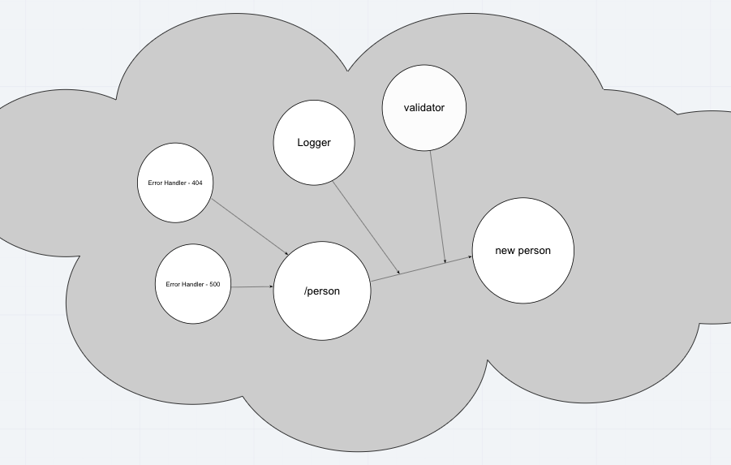

# LAB: Express

Dynamic API Phase 1: Build your core, standards compliant Express server

## [Link to GitHub Repository](https://github.com/carlydekock/basic-express-server.git)

## UML


## The Setup

### How to install

- Clone down repository from GitHub
- Run the command ```npm install``` to install dependencies (dotenv, express, jest, supertest)
- create .env file with PORT variable

### How to test

- Run the command ```npm test``` to test and verify the server is working

### How to run

- Start the server using ```nodemon```
- Visit http://localhost:PORT at the PORT number you've assigned in your .env

## Deployed links

- [Link to deployed site on Heroku](https://carlydekock-basic-express-serv.herokuapp.com/)
- [Link to GitHub actions](https://github.com/carlydekock/server-deployment-practice/actions)